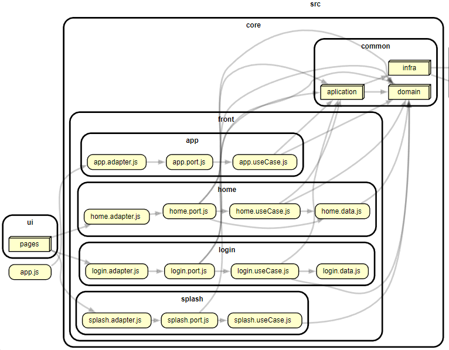

# MINI PROGRAM

- [MINI PROGRAM](#mini-program)
  - [Arquitectura](#arquitectura)
  - [Estructura](#estructura)
    - [Primer nivel](#primer-nivel)
      - [Carpeta _raiz_](#carpeta-raiz)
    - [Segundo nivel](#segundo-nivel)
      - [Carpeta _src_](#carpeta-src)
    - [Tercer nivel](#tercer-nivel)
      - [Carpeta _ui_](#carpeta-ui)
      - [Carpeta _core_](#carpeta-core)
    - [Dependencias internas](#dependencias-internas)
      - [Reglas generales](#reglas-generales)
      - [src](#src)
      - [ui](#ui)
      - [core](#core)
      - [front](#front)
      - [common](#common)
  - [Principios de desarrollo](#principios-de-desarrollo)
    - [POO](#poo)
      - [Abstracción](#abstracción)
      - [Encapsulasión](#encapsulasión)
      - [Herencia](#herencia)
      - [Polimorfismo](#polimorfismo)
    - [SOLID](#solid)
      - [Single responsiblity](#single-responsiblity)
      - [Open close](#open-close)
      - [Principio de sustitucion Liskov](#principio-de-sustitucion-liskov)
      - [Segregacion de interfaces](#segregacion-de-interfaces)
      - [Inversion de dependencias](#inversion-de-dependencias)
    - [Patrones de diseño GoF](#patrones-de-diseño-gof)
      - [Creacionales](#creacionales)
        - [Singleton](#singleton)
      - [Estructurales](#estructurales)
        - [Adapter](#adapter)
        - [Facade](#facade)
    - [Patrones GRASP](#patrones-grasp)
      - [Expert](#expert)
  - [Buenas Prácticas](#buenas-prácticas)
    - [Components vs Templates](#components-vs-templates)
    - [Estilos](#estilos)
    - [Javascript](#javascript)
    - [Pruebas unitarias](#pruebas-unitarias)
  - [Procedimiento de mantenibilidad de desarrollo](#procedimiento-de-mantenibilidad-de-desarrollo)
    - [Identificación de badSmells](#identificación-de-badsmells)
    - [Modularidad](#modularidad)
    - [Reusabilidad](#reusabilidad)
    - [Analizabilidad](#analizabilidad)
    - [Capacidad de ser modificado](#capacidad-de-ser-modificado)
    - [Capacidad de ser probado](#capacidad-de-ser-probado)
  - [Pendientes](#pendientes)

## Arquitectura

El desarrollo y su estructura se debe manejar y pensar sobre arquitectura hexagonal (aka ports & adapter), está arquitectura maneja 3 capas (_infra_,_application_,_domain_) con 3 elementos claves (_actors_,_adapters_,_ports_).
[Más info](https://medium.com/idealo-tech-blog/hexagonal-ports-adapters-architecture-e3617bcf00a0)


En el desarrollo de superapps debido a su naturaleza, inicialmente no se va a aplicar una arquitectura 100% cerrada, por lo que si eres algún purista arquitectoníco es probable que encuentres puntos de mejora/reforma a lo que se define en la estructura del proyecto y su manejo.

A continuación se encuentran unso diagramas realziados por parte del equipo wigilabs para explicar un poco mejor la arquitectura planteada:

- Arquitectura inicialmente planteada:


- Arquitectura limpia:


- Arquitectura Hexagonal:


## Estructura

La estructura de carpetas sugerida es la siguiente:

### Primer nivel

#### Carpeta _raiz_

Esta carpeta es la raiz del proyecto van ubicados los archivos generales de configuración del proyecto y una carpeta _src_.

```markdown
./miniapp
├── src
| ├── assets/
| ├── core/
│ ├── scripts/
│ ├── styles/
│ ├── ui/
│ ├── app.acss
│ ├── app.js
│ └── app.json
├── package.json
├── README.md
└── ... (config files)
```

### Segundo nivel

#### Carpeta _src_

Esta carpeta va a contener los archivos principales de la superapp (**_app.js_**,**_app.acss_**,**_app.json_**), así como unas subcarpetas que organizan el contenido de la superapp. La carpeta _assets_ va a contener los archivos tipo assets del app, tales como imágenes, fuentes, etc. La carpeta scripts va a contener todos los archivos **_.js_** globales de la superapp. La carpeta _styles_ va a contener los archivos de estilo globales de la superapp.

> El nombre de cada archivo debe usar la convención camelCase.

```markdown
../src
├── assets
| ├── img
│ │ ├── logo.png
│ └ └── ...
├── core
| ├── common/
| | ├── application/
| | ├── domain/
| | └── infra/
| └── front/
| | ├── app/
| | ├── inicio/
| | └── .../
├── scripts
│ ├── my.js
│ └── ...
├── styles
│ ├── all.acss
│ └── ...
├── ui
│ ├── components/
│ ├── pages/
│ └── templates/
├── app.acss
├── app.js
└── app.json
```

### Tercer nivel

#### Carpeta _ui_

Esta carpeta va contener los archivos altamente acoplados al framework, como son _pages_, _components_ y _templates_, con una subcarpeta para cada tipo de elemento.

- Carpeta _components_:

En esta carpeta deben estar todos los componentes (no externos) que utilice la aplicación. Cada componente de constar de 4 (cuatro) archivos para su correcto funcionamiento, todos con el mismo nombre **_index_** pero con diferentes extensiones según su funcionalidad. (**.axml**,**.acss**,**.js**,**.json**).

> El nombre de cada componente debe usar camelCase.

- Carpeta _pages_:

En esta carpeta deben estar todas las páginas que utilice la aplicación. Cada página de constar de 4 (cuatro) archivos para su correcto funcionamiento, todos con el mismo nombre **_index_** pero con diferentes extensiones según su funcionalidad. (**.axml**,**.acss**,**.js**,**.json**). El archivo .json NO es obligatorio si el framework no lo exige.

> El nombre de cada página debe usar camelCase.

- Carpeta _templates_

En esta carpeta deben estar todos los templates que utilice la aplicación. Cada template de tener únicamente 1 archivo para su correcto funcionamiento, **_index.axml_**.

> El nombre de cada template debe usar camelCase.

```markdown
../ui
├── components
│ ├── miComponente
│ │ ├── index.acss
│ │ ├── index.axml
│ │ ├── index.js
│ │ └── index.json
│ └── ... (otro componente)
├── pages
│ ├── inicio
│ │ ├── index.acss
│ │ ├── index.axml
│ │ ├── index.js
│ │ └── index.json
│ └── ... (otra pagina)
├── templates
│ ├── miTemplate
│ │ └──index.axml
└ └── ... (otro template)
```

#### Carpeta _core_

Esta carpeta va contener los archivos totalmente desacoplados al framework, básados en arquitectura hexagonal, estructurados en 2 subcarpetas, _common_ y _front_. Dentro de la carpeta _front_ van subcarpetas relacionadas a lo que se encuentra en la carpeta _ui_. Dentro de la carpeta common van subcarpetas dependiendo la "capa" de absatracción en donde se encuentre cada archivo (_infra_,_application_,_domain_)

- Carpeta _front_

En esta carpeta van subcarpetas relacionadas a lo que se encuentra en la carpeta _ui_. Adentro de cada subcarpeta se deben encontrar 5 (cinco) archivos nombrados con el mismo nombre de la subcarpeta "front" que los contiene seguido de su funcionalidad. ej:

- **_xxx.adapter.js_**: Archivo adaptador, se encuentra en la capa de abstracción de infra es la puerta de entrada desde la carpeta _ui_
- **_xxx.port.js_**: Archivo port, se encuentra en la capa de abstracción de aplicación y es la interfaz o puerta de enlace desde la capa de aplicación hacia la capa de dominio
- **_xxx.data.js_**: Archivo data, se encuentra en la capa de abstracción de dominio y contiene la definición de textos, constantes y data propia de cada front
- **_xxx.useCase.js_**: Archivo useCase, se encuentra en la capa de abstracción de dominio y contiene la lógica principal y los casos de uso detallados del app
- **_xxx.useCase.test.js_**: Archivo test, contiene las pruebas unitarias de cada front.

> El nombre de cada front debe usar camelCase y/o llamarse igual a su homologo en la carpeta ui.

```markdown
../core
| ├── common/...
| ├── front/
| | ├── app/
| | │ ├── app.adapter.js
| | │ ├── app.data.js
| | │ ├── app.port.js
| | │ ├── app.useCase.js
| | │ └── app.useCase.test.js
| | ├── inicio/
| | │ ├── inicio.adapter.js
| | │ ├── inicio.data.js
| | │ ├── inicio.port.js
| | │ ├── inicio.useCase.js
| | │ └── inicio.useCase.test.js
| | ├── ... (otro front)
| | │ ├── ...adapter.js
| | │ ├── ...data.js
| | │ ├── ...port.js
| | │ ├── ...useCase.js
└ └ └ └── ...useCase.test.js
```

- Carpeta _common_

En esta carpeta van subcarpetas dependiendo la "capa" de absatracción en donde se encuentre cada archivo (_infra_,_application_,_domain_).

- _infra_: Es la capa más externa y permite la comunicación de entrada/salida, contiene archivos **_xxx.adapter_**
- _application_: Es la capa intermedia entre la capa de _infra_ y la capa de _domain_,permite la comunicación entre las 2 capas y maneja una pequeña lógica a nivel negocio, contiene archivos **_xxx.port_**
- _domain_: Es la capa más interna y maneja la mayoría de lógica a nivel de aplicación/negocio, contiene archivos **_xxx.model_** y **_xxx.key_**

```markdown
../core
| ├── front/...
| ├── common/
| | ├── application/
| | │ ├── index.js
| | │ ├── xx.port.js
| | │ ├── yy.port.js
| | │ └── ...port.js
| | ├── domain/
| | │ ├── index.js
| | │ ├── xx.model.js
| | │ ├── yy.model.js
| | │ ├── keys.js
| | │ └── ...model.js
| | └── infra/
| | │ ├── index.js
| | │ ├── xx.adapter.js
| | │ ├── yy.adapter.js
└ └ └ └── ...adapter.js
```

### Dependencias internas

#### Reglas generales

Las dependencias internas deben seguir ciertas reglas generales, para poder cumplir correctamente tanto con la estructura como con la arquitectura definida, las reglas generales para las dependencias son las siguientes:

- Los archivos _index.js_ dentro de la carpeta ui _**SOLO**_ pueden conocer al archivo adapter ubicado en la carpeta front del módulo correspondiente. Estos archivos adapter hacen parte de la capa de infraestructura y son adaptadores primarios o manejadores, por lo que son la única puerta de entrada al core de la aplicación
- Los adaptadores primarios ubicados en la carpeta front para cada módulo, _**SOLO**_ pueden conocer al puerto del módulo correspondiente. Los archivos port dentro de la carpeta front hacen parte de la capa de aplicación y son puertos primarios o manejadores, por lo que son la única puerta de entrada a esta capa desde la capa de infraestructura.
- Los puertos primarios ubicados en la carpeta front _**SOLO**_ pueden conocer al caso de uso correspondiente para cada módulo, al archivo .data correspondiente para cada módulo, o a la capa de dominio común ubicada en la carpeta common. Estos puertos al ser primarios o manejadores, son de entrada y no pueden conocer o depender de la capa de infraestructura. Los casos de uso ubicados dentro de la carpeta front al igual que los puertos hacen parte de la capa de aplicación y es donde se encuentra la mayor parte lógica independiente y desacoplada para cada módulo. El archivo .data ubicado en la carpeta front hace parte de la capa de dominio y es el encargado de almacenar _**TODAS**_ las constantes o textos que van a ser usados por el módulo.
- Los casos de uso ubicados en la carpeta front pueden conocer a los puertos secundarios o manejados ubicados en la carpeta common, los archivos .data del módulo correspondiente o a la capa de dominio común ubicada en la carpeta common. Estos casos de uso hacen parte de la capa de aplicación, pero al no ser un puerto, no puede conocer o depender de la capa de infraestructura, asimismo, estos casos de uso hacen parte del flujo primario o manejador, lo que significa que van hacia el centro del core, por lo que no deben conocer tampoco al puerto primario.
- Los puertos secundarios o manejados ubicados en la carpeta common, solo pueden conocer a otros puertos secundarios de la misma capa, a la capa de dominio, o a la capa de infraestructura secundaria o manejada. Estos puertos hacen parte de la capa de aplicación y al ser secundarios o manejados no deben depender de los elementos primarios o manejadores tanto de la misma capa o exteriores, asi como tampoco debe depender de capas internas.
- Los adaptadores secundarios o manejados ubicados en la capa de infraestructura no deben depender de ninguna capa interna, y _**SOLO**_ debe depender de los elementos externos al core a los cuales quiera manejar.

A continuación se muestra una manera gráfica de como debería ser el flujo de las dependencias internas para cada carpeta:

#### src


#### ui


#### core


#### front



#### common


## Principios de desarrollo

Es de resaltar que para la correcta implementación de algunos principios de desarrollo hay ciertas restricciones por el lenguaje y el framework. Javascript como bien sabemos es un lenguaje no tipado pero con las ultimas versiones permite tener un pequeño acercamiento a POO y desarrollo basado en clases, por otro lado aunque el lenguaje se adapte, el Framework tiene ciertas restricciones de compatibilidad que no permiten realizar ciertas implementaciones de manera completa

### POO

#### Abstracción

Se utiliza la abstracción al momento de crear las diferentes clases con sus atributos y metodos, en cada una de las capas que estén correlacionadas a los objetos que se utilizan en el flujo de la aplicación

#### Encapsulasión

Aunque el lenguaje permite crear atributos y metodos privados, el framework no lo soporta, por lo que no se está haciendo uso de este mecanismo de manera estricta con atributos públicos y privados. Pero de manera no tan estricta se está realizando el uso de este principio con la ayuda de la implementación de la arquitectura, ya que cada módulo, de cada capa, encapsula su funcionalidad evitando exponer implementaciones concretas a las clases que dependan de esta

#### Herencia

Aunque el lenguaje permite utilizar la herencia debido a la baja complejidad de las miniapps y sobretodo a tener pocos tipos diferentes de objetos, por ahora, no se está haciendo uso de este mecanismo

#### Polimorfismo

Debido a que no se está haciendo uso de la herencia, este concepto no aplica al 100%, aunque para ciertas clases del dominio/aplicación se realizó la implementación de tal forma que cada función o método pueda adaptarse según la clase que la esté instanciando, utilizando una clase común liberandolo de la responsabilidad y delegandola a la implementación concreta de la clase

### SOLID

#### Single responsiblity

Este principio está siendo aplicado en casi todas las clases y funciones de la aplicación permitiendo que cada parte de código maneje su propia responsabilidad, permitiendole estar mas desacoplado, ser susceptible a cambios. Por ejemplo, este principio está siendo aplicado sobre los adaptadores, los puertos, los modelos y los casos de uso. Ej:

```javascript
export class CuentaModel {
	constructor(linea = {}) {
		this.AccountId = linea.AccountId || "";
		this.LineOfBusiness = linea.LineOfBusiness || "";
		this.alias = linea.alias || "";
		this.token = linea.token || "";
		this.info = linea.info || {};
		this.texto = linea.texto || "";
	}

	static instance;
	static get getInstance() {
		if (!this.instance) {
			this.instance = new CuentaModel();
		}
		return this.instance;
	}

	update(linea = {}) {
		this.AccountId = linea.AccountId || "";
		this.LineOfBusiness = linea.LineOfBusiness || "";
		this.alias = linea.alias || "";
		this.token = linea.token || "";
		this.info = linea.info || {};
		this.texto = linea.texto || "";

		return this;
	}
}
```

#### Open close

Con la implementación de la arquitectura realizada, la mayoría de clases están abiertas para que se pueda extender de ellas, pero son cerradas a modificación ya que debido al uso de _single responsability_ y _polimorfismo_ (en la medida que el lenguaje y el framework lo permiten), se permite cumplir con este principio

#### Principio de sustitucion Liskov

No aplica debido a que no se está aplicando herencia.

#### Segregacion de interfaces

Este principio se utiliza en toda la aplicación, ya que cada módulo o implementación abstracta solo conoce o depende de los métodos que realmente van a utilizar y no se genera dependecia de funciones o clases que el módulo no necesita, por lo que, no estaría forzado a depender de ellos, cumpliendo así con este principio

#### Inversion de dependencias

La inversión de dependencia permite que las piezas de alto nivel no dependan de implementaciones concretas. En su lugar se usa una abstracción que permite cambiar la implementación concreta en el futuro de ser necesario sin modificar las piezas de alto nivel. Por ejemplo, en el `StorageAdapter` se usa el `my` para guardar y traer los datos, pero este adapter podría ser cambiado para usar otro tipo de almacenamiento en el futuro sin modificar el resto de la aplicación. AL momento de importar modulos o funcionalidades no usar import \* sino en vez de eso importar solo los modulos a usar. Ej:

```javascript
import {clearStorage, getStorage, removeStorage, setStorage} from "../../../scripts/my";

export class StorageAdapter {
	constructor() {
		this.clearMy = clearStorage;
		this.setMy = setStorage;
		this.getMy = getStorage;
		this.removeMy = removeStorage;
	}

	clearr() {
		this.clearMy();
	}

	sett(infoStorage) {
		this.setMy(infoStorage.key, infoStorage.info);
	}

	async gett(key) {
		return await this.getMy(key);
	}

	removee(key) {
		this.removeMy(key);
	}
}
```

### Patrones de diseño GoF

#### Creacionales

##### Singleton

El patrón singleton restringe la inicialización de una clase para garantizar que solo se pueda crear una instancia de la clase. Los singleton se están implementando a través de una variable estática llamada instance y un getter estático que realiza una carga diferida.
Ej:

```javascript
export class StoragePort {
	static instance;

	constructor() {
		this.adapter = new StorageAdapter();
	}

	static get getInstance() {
		if (!this.instance) {
			this.instance = new StoragePort();
		}
		return this.instance;
	}

	limpiar() {
		this.adapter.clearr();
	}

	agregar(infoStorage) {
		this.adapter.sett(infoStorage);
	}

	async obtener(key) {
		return await this.adapter.gett(key);
	}
}
```

#### Estructurales

##### Adapter

El patrón adapter nos permite que dos interfaces no relacionadas puedan trabajar juntas. Por ejemplo, el `visualAdapter` permite que las funciones visuales nativas de `my` sean utilizadas desde el puerto. Ej:

```javascript
export class VisualAdapter {
	constructor() {
		this.alertmy = showAlert;
		this.loadingmy = showLoading;
		this.hideLoadingmy = hideLoading;
		this.createWebViewContext = createWebViewContext;
	}

	alert(alertInfo = {msg: "", title: ""}) {
		this.alertmy(alertInfo);
	}

	createWebViewContext(idwb) {
		return this.createWebViewContext(idwb);
	}

	loading(msg) {
		this.loadingmy(msg);
	}

	hideLoading() {
		this.hideLoadingmy();
	}
}
```

##### Facade

El patrón de diseño de fachada se usa para facilitar el uso de una funcionalidad a otros componentes del sistema. Por ejemplo, en el módulo `scripts/my` hay múltiples fachadas para facilitar el uso de funcionalidades del `my`. Ej:

```javascript
// scripts/my
export function showAlert({title = "Upps!!", msg = ""}) {
	my.alert({
		buttonText: "Aceptar",
		content: msg,
		title
	});
}

// client
showAlert({msg: "Buenas practicas"});
```

### Patrones GRASP

#### Expert

El patrón Expert (Experto) se refiere a asignar la responsabilidad de realizar una operación o manejar un conjunto de datos a la clase que tiene el conocimiento experto sobre esos datos u operaciones.
El patrón Expert se aplica en la clases del caso de uso, pertenecientes a la capa de aplicación, pro ejemplo `HomeUseCase`, al asignar la responsabilidad de gestionar el almacenamiento, consumir servicios y manipular modelos de datos correspondientes la funcionalidad de la página de inicio. `HomeUseCase` tiene el conocimiento experto sobre estas operaciones y encapsula la lógica necesaria para llevarlas a cabo. Esto mejora la cohesión de la clase y facilita el mantenimiento y la extensibilidad del código.

```javascript
export class HomeUseCase {
 constructor() {
  this.storagePort = StoragePort.getInstance;
  this.miclaroPort = new MiclaroPort();
  this.httpPort = HttpPort.getInstance;
  this.homeData = HomeData.getInstance;
 }

 obtenerDataInicial() {
  return new ResponseModel(new HomeData().data);
 }

 async getStorageCuenta() {
  return new ResponseModel(CuentaModel.getInstance.update(await this.storagePort.obtener(StorageKey.cuenta)));
 }

 async getStorageUsuario() {
  return new ResponseModel(await this.storagePort.obtener(StorageKey.usuario));
 }

 guardarStorageUsuario(perfilInfo) {
  this.storagePort.agregar(new StorageModel(StorageKey.usuario, perfilInfo));
  return new ResponseModel();
 }

 guardarStorageCuenta(cuenta = CuentaModel.getInstance) {
  this.storagePort.agregar(new StorageModel(StorageKey.cuenta, CuentaModel.getInstance.update(cuenta)));
  return new ResponseModel();
 }

 async reqWsLineasFijas(serviceBody) {
  try {
   const request = await this.miclaroPort.getRequest({serviceBody, servicio: MiClaroKey.services.lineasFijas});
   return new ResponseModel(await this.httpPort.execute(request));
  } catch (err) {
   return new ResponseModel(this.httpPort.errorHandler(err), true, HttpCodesKey.SERVER_ERROR);
  }
 }

 async reqWsLineasMoviles(serviceBody) {
  try {
   const request = await this.miclaroPort.getRequest({
    serviceBody,
    servicio: MiClaroKey.services.lineasMoviles
   });
   return new ResponseModel(await this.httpPort.execute(request));
  } catch (err) {
   return new ResponseModel(this.httpPort.errorHandler(err), true, HttpCodesKey.SERVER_ERROR);
  }
 }
}**
```

## Buenas Prácticas

A continuación algunas consideraciones o buenas prácticas a tener en cuenta al momento de desarrollar en superapps

### Components vs Templates

Cuando se reutilizan elementos dentro de diferentes páginas se deben utilizar components/templates para evitar repetir código, se deben usar de la siguiente manera:

- component: Cuando se requiere re utilizar un elemento entre diferentes páginas, y este elemento requiere el uso de lógica en archivos .js
- template: Cuando se requiere re utilizar un elemento entre diferentes páginas, y este elemento solamente es visual (.axml) o su lógica no requiere de archivos .js

> Evitar el uso de estilos propios de cada component/template, para esto usar estilos globales/comunes

### Estilos

1. No se debe usar estilos en línea dentro de los archivos .axml
2. Evitar crear estilos propios por cada página/componente/template dentro de los archivos .acss correspondientes
3. Usar los estilos globales/comunes, esto evitaría crear estilos propios para cada página/componente/template.
4. Aunque dentro de las miniapps existe la medida _rpx_ para el renderizado en los dispositivos, por retrocompatibilidad, evitar el uso de esta medida ("rpx") y en cambio usar "px","em" o "rem"
5. Para los estilos creados, No usar el nombre del tag como selector.
6. Los selectores de menor especificidad deben ubicarse antes que los selectores de mayor especificidad.
7. No deben existir propiedades duplicadas dentro de un selector
8. No tener imports duplicados
9. No usar selectores duplicados
10. No deben haber selectores vacios
11. No deben haber comentarios vacíos
12. Los colores hexadecimales deben ser correctos
13. Debe existir una línea o un espacio antes y después de una operacion dentro de la función calc
14. Cuando se usen gridareas, se debe crear almenos una celda y los token de celdas por fila debe ser equivalente
15. Los comentarios no pueden ser con doble slash
16. Los imports deben ir primero que cualquier regla de estilo
17. Las cadenas de texto deben ir en la misma linea

```html
<!--xfile.axml-->

<!--***PUNTO 1***-->
<!--NO-->
<view style="color:red;"></view>
<!--SI-->
<view class="rojo"></view>
```

```css
/*xfile.acss*/

/*******PUNTOS 2 - 3**********/
/*NO:*/
.botonPaginaInicio {
	color: red;
}
/*SI*/
/* --> usar estilos globales*/

/*******PUNTO 4**********/
/*NO:*/
.caja {
	width: 100rpx;
}
/*SI:*/
.caja {
	width: 100px;
}

/*******PUNTO 5**********/
/*NO:*/
view.miclase {
	color: red;
}
/*SI:*/
.miclase {
	color: red;
}

/*NO:*/
.miclase > image {
	width: 100%;
}
/*SI:*/
.miclase > .imagen {
	width: 100%;
}

/*******PUNTO 6**********/
/*NO:*/
b a {
}
a {
}
/*SI:*/
a {
}
b a {
}

/*NO:*/
b > a[foo] {
}
a[foo] {
}
/*SI:*/
a[foo] {
}
b > a[foo] {
}

/*NO:*/
a {
	& > b {
	}
}
b {
}
/*SI:*/
b {
}
a {
	& > b {
	}
}

/*******PUNTO 7**********/
/*NO:*/
a {
	color: pink;
	background: orange;
	color: orange;
}
/*SI:*/
a {
	color: pink;
	background: orange;
}

/*******PUNTO 8**********/
/*NO:*/
@import "a.css";
@import "b.css";
@import url(a.css);
@import "ba.css";
/*SI:*/
@import url("a.css") projection;
@import url("a.css") tv;
@import "b.css";

/*******PUNTO 9**********/
/*NO:*/
.foo,
.bar,
.foo {
}
/*SI:*/
.foo {
}
.bar {
}
.foo .bar {
}
.bar .foo {
}

/*NO:*/
@media (min-width: 10px) {
	.foo {
	}
	.foo {
	}
}
/*SI:*/
.foo {
}
@media (min-width: 10px) {
	.foo {
	}
}

/*NO:*/
a b {
}
a {
	& b {
	}
}
/*SI:*/
a b {
}
a {
	& b,
	& c {
	}
}

/*******PUNTO 10**********/

/*NO:*/
a {
}
b {
}
/*SI:*/
a {
	/* foo */
}
b {
	color: red;
}

/*******PUNTO 11**********/

/*NO:*/

/**/

/* */

/*

*/

/*SI:*/

/* comentario */

/*
 * Comentario multiple
**/

/*******PUNTO 12**********/

/*NO:*/
a {
	color: #00;
}
a {
	color: #fff1az;
}
a {
	color: #12345aa;
}

/*SI:*/
a {
	color: #000;
}
a {
	color: #000f;
}
a {
	color: #fff1a0;
}
a {
	color: #123450aa;
}

/*******PUNTO 13**********/

/*NO:*/
a {
	top: calc(1px+2px);
}
a {
	top: calc(1px+ 2px);
}

/*SI:*/
a {
	top: calc(1px + 2px);
}
a {
	top: calc(calc(1em * 2) / 3);
}
a {
	top: calc(calc(1em * 2) / 3);
}
a {
	top: calc(var(--foo) + var(--bar));
}
a {
	top: calc(var(--foo) + var(--bar));
}

/*******PUNTO 14**********/

/*NO:*/
a {
	grid-template-areas: "";
}
a {
	grid-template-areas:
		"a a a"
		"b b b b";
}
a {
	grid-template-areas:
		"a a a"
		"b b a";
}

/*SI:*/
a {
	grid-template-areas:
		"a a a"
		"b b b";
}

/*******PUNTO 15**********/

/*NO:*/
a {
	//color: pink;
}
//a { color: pink; }
// Comment {}
a {
	color: pink;
}
/*SI:*/
a {
	/* color: pink; */
}
/* a { color: pink;  } */

/*******PUNTO 16**********/

/*NO:*/
a {
}
@import "foo.css";
@media print {
}
@import "foo.css";
/*SI:*/
@import "foo.css";
a {
}
/*SI:*/
/* some comment */
@import "foo.css";
/*SI:*/
@charset 'utf-8';
@import "foo.css";
/*SI:*/
@layer default;
@import url(theme.css) layer(theme);

/*******PUNTO 17**********/

/*NO:*/
a {
	content: "first
    second";
}
[title="something
is probably wrong"] {
}
a {
	font-family: "Times
    New
    Roman";
}
/*SI:*/
a {
	content: "first\Asecond";
}
a {
	content: "first\\nsecond";
}
[title="nothing\
  is wrong"] {
}
a {
	font-family: "Times New Roman";
}
```

### Javascript

- framework:

  - Evitar el uso de la variable **my** en el archivo **index.js** dentro de las páginas/componentes.
  - Dentro de la carpeta "/scripts" debe existir un archivo "my.js" el cuál **_DEBE_** ser el único lugar del proyecto donde se utilice esta variable
  - Evitar al máximo el uso de librerías externas
  - Optimizar el uso de "_this.setData()_" para ejecutarlo la cantidad mínima de veces posible
  - Usar la información que se necesita entre pantalla con el storage, en vez de la función _getApp()_

- variables:

  - Los nombres de las clases deben ir en PascalCase y deben contener las palabras "Adapter","Port","Model","Key""UseCase". ej: "LoginAdapter"
  - Los nombres de las constantes numéricas, cuando se utilizan para corregir el error de magic numbers, pueden ir en camelCase o pueden ir en SREAMING_SNAKE_CASE y terminar con "\_NUMBER". ej: "LINE_NUMBER"
  - Los nombres del resto de variables deben estar en camelCase
  - Las variables deben ser inicializadas al momento de la declaración
  - La declaración e inicialización de variables "var" y "let" deben ir en un solo instante, en lineas diferentes
  - La declaración e inicialización de "const" deben ir máximo una por linea
  - Los nombres de las variables debe ser mínimo 3, máximo 20 caracteres

- estandar:
  - Se deben evitar los magic number
  - Se deben evitar los console.log
  - Las comparaciones se deben hacer con triple igual en vez de doble (===)
  - La definicion de variables/funciones se debe hacer antes de su uso
  - Las funciones deben tener una forma de retorno consistente
  - Los switch deben tener un case default
  - La máxima profundidad de anidación es de 3
  - Cuando se esté recorriendo un loop for-in se debe garantizar que los atributos que se van a usar existen en el objeto
  - siempre que se use await debe ir dentro de una funcion async y no puede existir una funcion async si no usa await
  - La cantidad máxima de declaraciones por función es de 15
  - Los imports deben estar ordenados alfabeticamente y primero deben estar los imports multiples sobre los sencillos
  - Las llaves de los objetos deben estar ordenadas alfabeticamente
  - No deben existir funciones vacías
  - La cantidad máxima de lineas de código por archivo, sin inlcuir comentarios ni lineas en blanco es de 300
  - La cantidad máxima de callbacks anidados es 3
  - La cantidad máxima de parámetros por función es 3
  - La longitud máxima de caracteres en una línea de código es 120
  - La cantidad máxima de declaraciones por línea es 1
  - Despues de usar la palabra "new", es decir, crear una nueva instancia de un objeto el objeto a instanciar debe empezar con mayúscula
  - Las comillas deben ser dobles
  - Se debe usar punto y coma al final de las sentencias
  - La identación se debe realizar con tabs (2)

### Pruebas unitarias

Las pruebas unitarias son una parte fundamental en el desarrollo de software, ya que nos permiten verificar el correcto funcionamiento de las unidades de código de forma aislada. Jest es un framework de pruebas muy popular en el ecosistema de JavaScript, que proporciona una amplia gama de funcionalidades para realizar pruebas unitarias de manera efectiva y eficiente. A continuación, se presentan algunas consideraciones generales para tener en cuenta al escribir pruebas unitarias utilizando Jest, como parte de las buenas prácticas de desarrollo.

- **Nomenclatura clara y concisa**: Es importante utilizar nombres descriptivos para las pruebas de modo que se entienda fácilmente qué se está probando y qué resultado se espera. Esto facilita la lectura y comprensión de las pruebas, tanto para el desarrollador que las escribe como para otros miembros del equipo.

```javascript
 test("si hay exito consumiendo el servicio detalleFactura obtenemos una repuesta exitosa", async () => {}):
```

- **Organización estructurada**: Se recomienda organizar las pruebas en suites, para cada caso de uso podemos crear una suite (como se definió anteriormente en la estructura de archivos) y podemos agrupar pruebas relacionadas con la función describe de Jest.

```javascript
describe("cuando consumimos servicios", () => {
	const mockAccount = MockAccount;
	const mockUser = MockPerfilModel;
	const mockSystemInfo = MockSystemInfo;

	test("si hay exito consumiendo el servicio detalleFactura obtenemos una repuesta exitosa", async () => {});

	test("si hay error consumiendo el servicio detalleFactura obtenemos una repuesta con error", async () => {});

	test("si hay exito consumiendo el servicio facturaPDF obtenemos una repuesta exitosa", async () => {});

	test("si hay error consumiendo el servicio facturaPDF obtenemos una repuesta con error", async () => {});
});
```

- **Uso de expectativas claras**: Las expectativas son fundamentales en las pruebas unitarias, ya que verifican los resultados esperados.

```javascript
expect(result.code).toEqual(200);
expect(result.error).toEqual(false);
expect(result.info).toEqual(mockLastInvoicesResponse);
```

- **Mocking adecuados**: Un uso adecuado de mocks ayuda a mantener las pruebas independientes y reduce la complejidad de las interacciones externas. En base a la arquitectura que estamos trabajando decidimos simular los adaptadores de los puertos que estén siendo utilizados dentro del caso de uso de esta manera podemos verificar que el flujo desde el caso de uso hasta el adaptador se está realizando correctamente.

```javascript
jest.mock("../../common/infra/storage.adapter");
jest.mock("../../common/infra/http.adapter");
jest.mock("../../common/infra/phone.adapter");
jest.mock("../../common/infra/visual.adapter");
```

- **Coverage**: Jest ofrece soporte integrado para la generación de informes de cobertura de código. Es una práctica recomendada asegurarse de que las pruebas cubran la mayor cantidad posible de código, incluyendo diferentes caminos de ejecución y casos límite. La cobertura de código ayuda a identificar áreas no probadas y mejorar la calidad del software.

- **Ejecución rápida y confiable**: Las pruebas unitarias deben ser rápidas y confiables. Jest es conocido por su velocidad de ejecución y su capacidad para paralelizar las pruebas. Es importante asegurarse de que las pruebas se ejecuten en un tiempo razonable para facilitar la _integración continua_ y la retroalimentación rápida durante el proceso de desarrollo.

- **Mantenimiento continuo**: Las pruebas unitarias deben mantenerse actualizadas y relevantes a medida que el código evoluciona. A medida que se realicen cambios en el código fuente, es importante revisar y actualizar las pruebas correspondientes para garantizar su validez.

## Procedimiento de mantenibilidad de desarrollo

### Identificación de badSmells

Para identificar los errores de programación generados por la práctica incorrecta de diseño, hemos implementado revisiones de código periódicas y fomentado una cultura de revisión entre el equipo de desarrollo a traves de las aprobaciones de 4 desarrolladores en los PullRequest, ademas de requerir el cumplimiento de las reglas anteriormente descritas en el apartado de buenas prácticas.

### Modularidad

Con la implementación de esta arquitectura, ha sido posible dividir el código en módulos independientes y cohesivos que realicen una única tarea o función (Modelos, puertos, casos de uso).
Aplicando los principios de desarrollo mencionados anterormente como responsabilidad única (Single Responsibility Principle), etc, para que en cada módulo se garantice una correcta modularidad, pudiendo así generar cambios totalmente desacoplados evitando fallos de implementación al momento de realizar estos.

### Reusabilidad

Se han diseñado componentes y módulos que son genéricos y pueden ser utilizados en diferentes contextos y se han creado bibliotecas o módulos compartidos que contienen funcionalidades comunes utilizadas en varios proyectos. Agrupandolos en las capas correspondientes (Dominio,Aplicación o Infraestructura)

### Analizabilidad

La comprensión del código se ha facilitado mediante una estructura clara y bien organizada.
Es importante utilizar nombres de variables, funciones y clases descriptivos y significativos,
evitar la duplicidad de código y favorecer la abstracción y la generalización, así como seguir las reglas definidas en el apartado de buenas prácticas.
Es relevante también utilizar herramientas de análisis estático para identificar posibles problemas y mejorar la calidad del código.

### Capacidad de ser modificado

Como se ha abarcado anteriormente utilizar patrones de diseño permitan la incorporación de nuevas funcionalidades sin afectar el código existente y evitar acoplamientos fuertes entre los diferentes componentes del sistema, favoreciendo la comunicación a través de interfaces.

### Capacidad de ser probado

Al diseñar el código de manera modular y con una separación clara entre las responsabilidades, a traves de los casos de uso podemos implementar pruebas unitarias para verificar el comportamiento esperado de cada componente individualmente. Esto se esta logrando haciendo uso de el framework Jest, como se menciono anteriormente.

Tambien seria aconsejable realizar pruebas sobre los puertos.

## Pendientes

Si existen desarrollos donde aún quede trabajo por realizar pero se debe desplegar para pruebas, por ejemplo, Información "quemada", uso de estilos o scripts que no cumplan con los estándares. Se debe crear el comentario TODO para poder hacer un correcto seguimiento de estas actividades:

Ej:

```javascript
/*page/x/index.js*/

//TODO: solucionar el error de magic numbers
const cantidad = hijos + 50;
```

<sub> Editado por: jmejia@wigilabs.com - jgaray@wigilabs.com | (07/2023) </sub>
